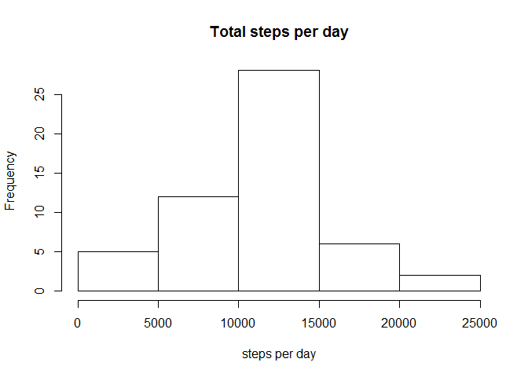
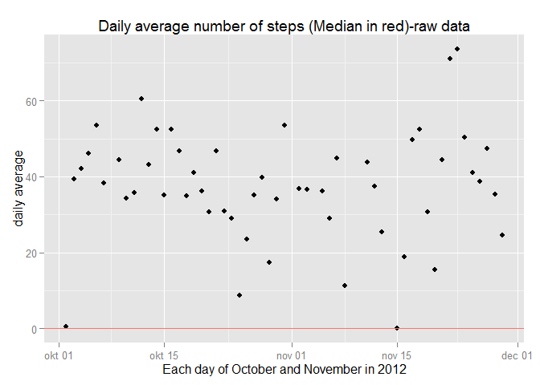
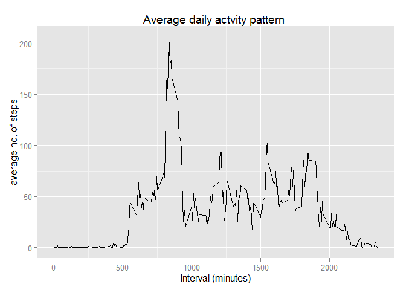
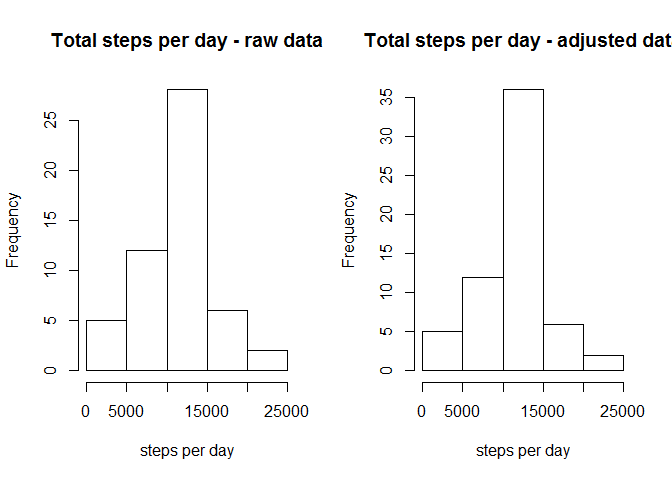
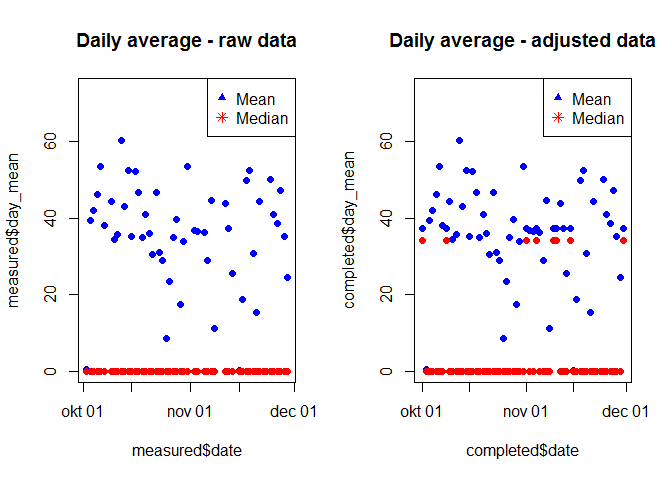
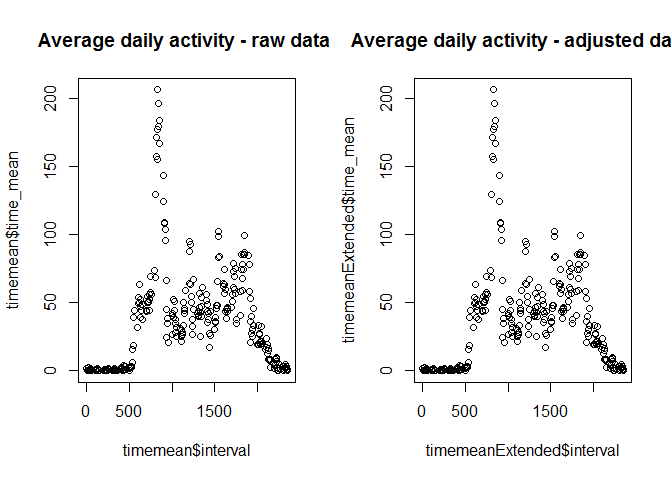
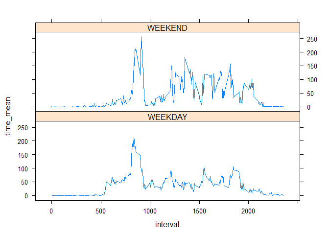

# Project1
SNB  
Saturday, July 11, 2015  
=================================================================================

Calling the required libraries:

=================================================================================


```r
library(ggplot2)
library(lattice)
library(dplyr)
```

```
## 
## Attaching package: 'dplyr'
## 
## The following object is masked from 'package:stats':
## 
##     filter
## 
## The following objects are masked from 'package:base':
## 
##     intersect, setdiff, setequal, union
```

```r
par(mfrow=c(1,1))
```
================================================================================

Reading the Activity data:

#Loading and preprocessing the data

=================================================================================


```r
activity <- read.csv("activity.csv",stringsAsFactors=F)
activity[,2]<-as.Date(activity[,2])
head(activity)
```

```
##   steps       date interval
## 1    NA 2012-10-01        0
## 2    NA 2012-10-01        5
## 3    NA 2012-10-01       10
## 4    NA 2012-10-01       15
## 5    NA 2012-10-01       20
## 6    NA 2012-10-01       25
```

```r
summary(activity)
```

```
##      steps             date               interval     
##  Min.   :  0.00   Min.   :2012-10-01   Min.   :   0.0  
##  1st Qu.:  0.00   1st Qu.:2012-10-16   1st Qu.: 588.8  
##  Median :  0.00   Median :2012-10-31   Median :1177.5  
##  Mean   : 37.38   Mean   :2012-10-31   Mean   :1177.5  
##  3rd Qu.: 12.00   3rd Qu.:2012-11-15   3rd Qu.:1766.2  
##  Max.   :806.00   Max.   :2012-11-30   Max.   :2355.0  
##  NA's   :2304
```
===as==============================================================================

Removing the incomplete day data and summarising the total, average and median:

#What is mean total number of steps taken per day?

=================================================================================


```r
measured <- activity[complete.cases(activity),]
measured <- group_by(measured,date)%>%
summarize(day_sum=sum(steps), day_mean=mean(steps), day_median=median(steps))
head(measured)
```

```
## Source: local data frame [6 x 4]
## 
##         date day_sum day_mean day_median
## 1 2012-10-02     126  0.43750          0
## 2 2012-10-03   11352 39.41667          0
## 3 2012-10-04   12116 42.06944          0
## 4 2012-10-05   13294 46.15972          0
## 5 2012-10-06   15420 53.54167          0
## 6 2012-10-07   11015 38.24653          0
```

```r
summary(measured)
```

```
##       date               day_sum         day_mean         day_median
##  Min.   :2012-10-02   Min.   :   41   Min.   : 0.1424   Min.   :0   
##  1st Qu.:2012-10-16   1st Qu.: 8841   1st Qu.:30.6979   1st Qu.:0   
##  Median :2012-10-29   Median :10765   Median :37.3785   Median :0   
##  Mean   :2012-10-30   Mean   :10766   Mean   :37.3826   Mean   :0   
##  3rd Qu.:2012-11-16   3rd Qu.:13294   3rd Qu.:46.1597   3rd Qu.:0   
##  Max.   :2012-11-29   Max.   :21194   Max.   :73.5903   Max.   :0
```
=================================================================================

Ploting the frequences of the steps,and the daily average over the two months:

=================================================================================

```r
hist(measured$day_sum, main="Total steps per day", xlab="steps per day")
```

 

```r
measured[,c(1,3,4)]
```

```
## Source: local data frame [53 x 3]
## 
##          date day_mean day_median
## 1  2012-10-02  0.43750          0
## 2  2012-10-03 39.41667          0
## 3  2012-10-04 42.06944          0
## 4  2012-10-05 46.15972          0
## 5  2012-10-06 53.54167          0
## 6  2012-10-07 38.24653          0
## 7  2012-10-09 44.48264          0
## 8  2012-10-10 34.37500          0
## 9  2012-10-11 35.77778          0
## 10 2012-10-12 60.35417          0
## ..        ...      ...        ...
```

```r
qp<-qplot(date,day_mean, data=measured, main="Daily average number of steps (Median in red)-raw data", ylab="daily average", xlab="Each day of October and November in 2012")
qpMeasured <- qp+geom_hline(aes(yintercept=0,col="red"))
qpMeasured
```

 

=================================================================================

Average daily activity pattern plotted:

#What is the average daily activity pattern?

=================================================================================

```r
existing <- activity[complete.cases(activity),]
timemean <-group_by(existing, interval)%>%
           summarize(time_sum=sum(steps), time_mean=mean(steps))
head(timemean)
```

```
## Source: local data frame [6 x 3]
## 
##   interval time_sum time_mean
## 1        0       91 1.7169811
## 2        5       18 0.3396226
## 3       10        7 0.1320755
## 4       15        8 0.1509434
## 5       20        4 0.0754717
## 6       25      111 2.0943396
```

```r
summary(timemean)
```

```
##     interval         time_sum         time_mean      
##  Min.   :   0.0   Min.   :    0.0   Min.   :  0.000  
##  1st Qu.: 588.8   1st Qu.:  131.8   1st Qu.:  2.486  
##  Median :1177.5   Median : 1808.0   Median : 34.113  
##  Mean   :1177.5   Mean   : 1981.3   Mean   : 37.383  
##  3rd Qu.:1766.2   3rd Qu.: 2800.2   3rd Qu.: 52.835  
##  Max.   :2355.0   Max.   :10927.0   Max.   :206.170
```

```r
with(timemean, qplot(interval,time_mean, xlab="Interval (minutes)", ylab="average no. of steps",
main="Average daily actvity pattern ", geom="line"))
```

 
#MAXIMUM DAY TIME AVERAGE ACTIVTY: 

```r
maxmean <- max(timemean$time_mean)
cat("The maximum average day time activity = ",maxmean,".")
```

```
## The maximum average day time activity =  206.1698 .
```

```r
peaktime <- filter(timemean, time_mean==maxmean)
peakhour <- peaktime$interval
cat("It occurs at the ", peakhour," minute interval, that is, at ",as.integer(peakhour/60)," hours, ",peakhour%%60," minutes.")
```

```
## It occurs at the  835  minute interval, that is, at  13  hours,  55  minutes.
```


=================================================================================

Modelling the missing obsevations:

#Imputing missing values

=================================================================================

CALCULATING THE NUMBER OF MISSING OBSERVATIONS


```r
lact <- length(activity$steps)
no_missing <- lact-length(existing$steps)
cat("The number of missing recordings is ",no_missing,", that is, ",as.integer(no_missing/lact*100),"%.")
```

```
## The number of missing recordings is  2304 , that is,  13 %.
```

REPLACING the MISSING RECORDINGS with the MEAN OF THE DAILY TIME INTERVAL READING:


```r
estimates <- activity
for (i in 1:lact) {
    if (is.na(estimates[i,1])) {
        filt <- filter(timemean,interval==estimates[i,3])
        estimates[i,1] <- filt[1,3]
    }
}   
head(estimates)
```

```
##       steps       date interval
## 1 1.7169811 2012-10-01        0
## 2 0.3396226 2012-10-01        5
## 3 0.1320755 2012-10-01       10
## 4 0.1509434 2012-10-01       15
## 5 0.0754717 2012-10-01       20
## 6 2.0943396 2012-10-01       25
```

```r
summary(estimates)
```

```
##      steps             date               interval     
##  Min.   :  0.00   Min.   :2012-10-01   Min.   :   0.0  
##  1st Qu.:  0.00   1st Qu.:2012-10-16   1st Qu.: 588.8  
##  Median :  0.00   Median :2012-10-31   Median :1177.5  
##  Mean   : 37.38   Mean   :2012-10-31   Mean   :1177.5  
##  3rd Qu.: 27.00   3rd Qu.:2012-11-15   3rd Qu.:1766.2  
##  Max.   :806.00   Max.   :2012-11-30   Max.   :2355.0
```
=================================================================================

Comparison of statistics tables with and without missing observations

=================================================================================


```r
completed <- group_by(estimates,date)%>%
summarize(day_sum=sum(steps), day_mean=mean(steps), day_median=median(steps))
head(completed)
```

```
## Source: local data frame [6 x 4]
## 
##         date  day_sum day_mean day_median
## 1 2012-10-01 10766.19 37.38260   34.11321
## 2 2012-10-02   126.00  0.43750    0.00000
## 3 2012-10-03 11352.00 39.41667    0.00000
## 4 2012-10-04 12116.00 42.06944    0.00000
## 5 2012-10-05 13294.00 46.15972    0.00000
## 6 2012-10-06 15420.00 53.54167    0.00000
```

```r
summary(completed)
```

```
##       date               day_sum         day_mean         day_median    
##  Min.   :2012-10-01   Min.   :   41   Min.   : 0.1424   Min.   : 0.000  
##  1st Qu.:2012-10-16   1st Qu.: 9819   1st Qu.:34.0938   1st Qu.: 0.000  
##  Median :2012-10-31   Median :10766   Median :37.3826   Median : 0.000  
##  Mean   :2012-10-31   Mean   :10766   Mean   :37.3826   Mean   : 4.474  
##  3rd Qu.:2012-11-15   3rd Qu.:12811   3rd Qu.:44.4826   3rd Qu.: 0.000  
##  Max.   :2012-11-30   Max.   :21194   Max.   :73.5903   Max.   :34.113
```

```r
timemeanExtended <-group_by(estimates, interval)%>%
           summarize(time_sum=sum(steps), time_mean=mean(steps))
head(timemeanExtended)
```

```
## Source: local data frame [6 x 3]
## 
##   interval   time_sum time_mean
## 1        0 104.735849 1.7169811
## 2        5  20.716981 0.3396226
## 3       10   8.056604 0.1320755
## 4       15   9.207547 0.1509434
## 5       20   4.603774 0.0754717
## 6       25 127.754717 2.0943396
```

```r
summary(timemeanExtended)
```

```
##     interval         time_sum         time_mean      
##  Min.   :   0.0   Min.   :    0.0   Min.   :  0.000  
##  1st Qu.: 588.8   1st Qu.:  151.6   1st Qu.:  2.486  
##  Median :1177.5   Median : 2080.9   Median : 34.113  
##  Mean   :1177.5   Mean   : 2280.3   Mean   : 37.383  
##  3rd Qu.:1766.2   3rd Qu.: 3222.9   3rd Qu.: 52.835  
##  Max.   :2355.0   Max.   :12576.4   Max.   :206.170
```
MAXIMUM DAILY AVERAGE ACTIVITY:


```r
maxmean <- max(timemeanExtended$time_mean)
cat("The maximum daily average number of steps = ", maxmean,".")
```

```
## The maximum daily average number of steps =  206.1698 .
```

```r
peaktime <- filter(timemeanExtended, time_mean==maxmean)
peakhour <- peaktime$interval
cat("It occurs at the ",peakhour, " minutes interval, that is, at ",as.integer(peakhour/60)," hours ",peakhour%%60," minutes.")
```

```
## It occurs at the  835  minutes interval, that is, at  13  hours  55  minutes.
```
Comparative plots


```r
par(mfrow=c(1,2))
hist(measured$day_sum, main="Total steps per day - raw data", xlab="steps per day")
hist(completed$day_sum, main="Total steps per day - adjusted data", xlab="steps per day")
```

 

```r
par(mfrow=c(1,1))
```


```r
par(mfrow=c(1,2))
plot(measured$date, measured$day_mean,col="blue",main="Daily average - raw data", pch=19)
points(measured$date, measured$day_median, col="red", pch=19)
legend("topright", pch=c(17,8),col=c("blue","red"),legend=c("Mean", "Median"))

plot(completed$date, completed$day_mean,col="blue",main="Daily average - adjusted data", pch=19)
points(completed$date, completed$day_median, col="red", pch=19)
legend("topright", pch=c(17,8),col=c("blue","red"),legend=c("Mean", "Median"))
```

 

```r
par(mfrow=c(1,1))
```


```r
par(mfrow=c(1,2))
plot(timemean$interval, timemean$time_mean,main="Average daily activity - raw data ", lty=1)
plot(timemeanExtended$interval, timemeanExtended$time_mean,main="Average daily activity - adjusted data ", lty=1)
```

 

```r
par(mfrow=c(1,1))
```

CONCLUSION

The comparison between the raw and the adjusted data reflects the choice of the daily mean as the extrapolation, since the frequencies of the daily means are naturally increased, the median values shifted slightly, while the means themselves show very slight variation. 
Were the proportion of omitted values higher than the approximately 13%, then more markant effects might be shown.

=================================================================================

Separating the patterns of the weekday and weekend data:

Are there differences in activity patterns between weekdays and weekends?

=================================================================================


```r
    DayTypeEstimates <-estimates
    for (i in 1:lact) {
        y <- as.POSIXlt(estimates[i,2])
        z <- y$wday
        if (z == 6 | z== 7) {
            DayTypeEstimates[i,4] <- "WEEKEND"
            }
            else {
            DayTypeEstimates[i,4] <- "WEEKDAY"
            }
        }
    names(DayTypeEstimates) <- c(names(estimates), "day_type")
    DayTypeEstimates[,4] <- as.factor(DayTypeEstimates[,4])
    str(DayTypeEstimates)
```

```
## 'data.frame':	17568 obs. of  4 variables:
##  $ steps   : num  1.717 0.3396 0.1321 0.1509 0.0755 ...
##  $ date    : Date, format: "2012-10-01" "2012-10-01" ...
##  $ interval: int  0 5 10 15 20 25 30 35 40 45 ...
##  $ day_type: Factor w/ 2 levels "WEEKDAY","WEEKEND": 1 1 1 1 1 1 1 1 1 1 ...
```
TIME SERIES PLOTS comparing WEEKDAY and WEEKEND Activity
 
Grouping means by Weekday and Weekend


```r
WeekDay <- filter(DayTypeEstimates, day_type=="WEEKDAY")
WeekDayMeans <- group_by(WeekDay, interval)%>%
                summarize(time_sum=sum(steps), time_mean=mean(steps))
        noWD <- length(WeekDayMeans$interval)
        WeekDayMeans[,4] <-c(rep("WEEKDAY",noWD))
WeekEnd <- filter(DayTypeEstimates, day_type=="WEEKEND")
WeekEndMeans <- group_by(WeekEnd, interval)%>%
                summarize(time_sum=sum(steps), time_mean=mean(steps))
        noWE <- length(WeekEndMeans$interval)
        WeekEndMeans[,4] <-c(rep("WEEKEND",noWE))
    DayType <- rbind(WeekDayMeans, WeekEndMeans)
    names(DayType) <- c(names(timemean), "day_type")
    DayType$day_type <-as.factor(DayType$day_type)
    str(DayType)
```

```
## Classes 'tbl_df', 'tbl' and 'data.frame':	576 obs. of  4 variables:
##  $ interval : int  0 5 10 15 20 25 30 35 40 45 ...
##  $ time_sum : num  103.02 20.38 7.92 9.06 4.53 ...
##  $ time_mean: num  1.9438 0.3845 0.1495 0.1709 0.0854 ...
##  $ day_type : Factor w/ 2 levels "WEEKDAY","WEEKEND": 1 1 1 1 1 1 1 1 1 1 ...
##  - attr(*, "drop")= logi TRUE
```

```r
 xyplot(time_mean~interval | day_type, 
        data=DayType,layout=c(1,2),type="l",lwd=1,lty=1)
```

 


CONCLUSION:

The general pattern for both weekdays and weekends is that the activity 
increases to a maximum at lunch time, and continues to be moderate in the afternoon until evening.
As to be expected the maximum is higher in the weekend, as is the afternoon activity, 
but it starts later in the morning than during the week.
